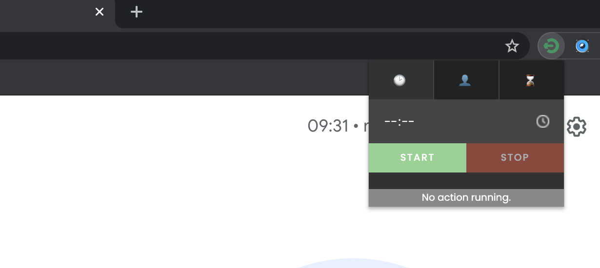

`2021 Series`
# Google Meet Auto Leave
Leave Google Meet after specific members count, time and minutes.

### Usage
1. Download / Clone the project folder
2. Go to Chrome > Extensions
3. Enable Developer Mode
4. Load Unpacked Extension and choose the project folder

- Open Google Meet and join the room
- Open the Google Meet Auto Leave extension from the extensions tab
- Set your desired leave action (leave at time, leave when members count, leave after minutes)

### Development
* HTML5
* CSS3
* JavaScript

---

### Other Links
* Personal website: [https://xsuve.com/](https://xsuve.com/)
* Dribbble: [https://dribbble.com/xsuve/](https://dribbble.com/xsuve/)
* Twitter: [https://twitter.com/xsuve_/](https://twitter.com/xsuve_/)
* Instagram: [https://instagram.com/xsuvecom/](https://instagram.com/xsuvecom/)
